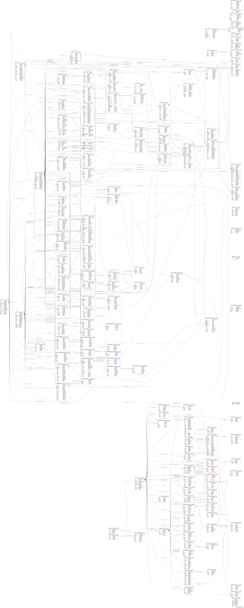

# Fleetbase Database Schema

This document describes the database schema for Fleetbase, a modular logistics and supply chain operating system.

## Entity Relationship Diagrams

The database schema is visualized through Entity Relationship Diagrams (ERDs) that show the complete structure of the Fleetbase database.

### Light Theme ERD



**File:** `erd.svg`

This diagram provides a comprehensive view of the Fleetbase database schema, including:
- All database tables and their columns
- Data types for each column
- Primary keys (PK)
- Foreign keys (FK)
- Unique keys (UK)
- Relationships between entities

### Dark Theme ERD


**File:** `erd-dark.svg`

The same schema diagram optimized for dark mode viewing environments.

## Schema Components

The Fleetbase database consists of two main schema groups:

### 1. Core Fleetbase Schema (fleetbase_*)

The core Fleetbase tables support the fundamental logistics and supply chain operations:

#### Key Entity Groups:

- **Companies & Users**: User management, authentication, roles, and permissions
  - `fleetbase_companies`
  - `fleetbase_users`
  - `fleetbase_roles`
  - `fleetbase_permissions`
  - `fleetbase_company_users`

- **Fleet Management**: Drivers, vehicles, and fleet organization
  - `fleetbase_drivers`
  - `fleetbase_vehicles`
  - `fleetbase_fleets`
  - `fleetbase_vehicle_devices`

- **Order Management**: Orders, payloads, and tracking
  - `fleetbase_orders`
  - `fleetbase_payloads`
  - `fleetbase_entities`
  - `fleetbase_waypoints`
  - `fleetbase_tracking_numbers`
  - `fleetbase_tracking_statuses`

- **Locations**: Places, service areas, and zones
  - `fleetbase_places`
  - `fleetbase_service_areas`
  - `fleetbase_zones`

- **Service Management**: Service rates, quotes, and pricing
  - `fleetbase_service_rates`
  - `fleetbase_service_quotes`
  - `fleetbase_service_rate_fees`

- **Vendors & Integrations**: Vendor management and third-party integrations
  - `fleetbase_vendors`
  - `fleetbase_integrated_vendors`

- **Files & Media**: File storage and management
  - `fleetbase_files`

- **API & Webhooks**: API credentials, events, and webhook management
  - `fleetbase_api_credentials`
  - `fleetbase_api_events`
  - `fleetbase_webhook_endpoints`

- **Extensions**: Modular extension system
  - `fleetbase_extensions`
  - `fleetbase_extension_installs`
  - `fleetbase_registry_extensions`

- **Storefront**: E-commerce and storefront functionality
  - `fleetbase_storefront_stores`
  - `fleetbase_storefront_products`
  - `fleetbase_storefront_networks`
  - `fleetbase_storefront_orders`

### 2. FixFlo Extension Schema (fixflo_*)

The FixFlo extension provides specialized functionality for fixture management in the maritime shipping industry:

#### Key Entity Groups:

- **Fixtures**: Core fixture data and management
  - `fixflo_fixtures`
  - `fixflo_fixture_values`
  - `fixflo_fixture_sets`
  - `fixflo_fixture_groups`

- **Vessels**: Vessel information and tracking
  - `fixflo_vessels`

- **Ports & Zones**: Geographic data for shipping routes
  - `fixflo_zones`
  - `fixflo_boundaries`

- **Cargo**: Cargo types and grades
  - `fixflo_cargo_grades`
  - `fixflo_sub_cargo_grades`

- **Charterers**: Charterer information
  - `fixflo_charterers`

- **Boards & Collaboration**: Board management and collaboration features
  - `fixflo_boards`
  - `fixflo_board_members`
  - `fixflo_board_groups`
  - `fixflo_free_board_columns`

- **Reporting**: Report generation and templates
  - `fixflo_reports`
  - `fixflo_report_templates`
  - `fixflo_report_types`

## Generating the ERD

To regenerate the Entity Relationship Diagrams, use the provided script:

```bash
./create-erd.sh
```

### Prerequisites

The script requires the following tools:

1. **SchemaCrawler** - Database schema discovery and documentation tool
   - Download: https://www.schemacrawler.com/downloads.html
   
2. **Mermaid CLI (mmdc)** - Command-line interface for Mermaid diagrams
   - Installation: `npm install -g @mermaid-js/mermaid-cli`

3. **Python 3** - For adding accessibility metadata to SVG files

### What the Script Does

1. Connects to the MySQL database and extracts schema information
2. Generates a Mermaid diagram file (`database.mmd`)
3. Creates the light theme SVG diagram (`erd.svg`) using SchemaCrawler
4. Creates the dark theme SVG diagram (`erd-dark.svg`) using Mermaid CLI
5. Adds accessibility metadata (title, description, ARIA attributes) to both SVG files

## Accessibility

Both ERD files include proper accessibility features:

- **Title elements** with unique IDs for clear diagram identification
- **Description elements** providing detailed information about the diagram content
- **ARIA attributes** (`role`, `aria-labelledby`) for screen reader compatibility
- Optimized for both light and dark viewing modes

This ensures the diagrams are accessible to users with visual impairments and can be properly indexed by search engines.

## Database Naming Conventions

- Tables use snake_case naming convention
- Table names are prefixed with either `fleetbase_` (core) or `fixflo_` (extension)
- Primary keys are typically named `id` or have `_id` suffix
- Foreign keys use `_uuid` suffix and reference the `uuid` column of parent tables
- UUIDs (CHAR(36)) are used as the primary identifier for cross-table relationships
- Timestamps include `created_at`, `updated_at`, and `deleted_at` for soft deletes

## Key Relationships

The schema uses a UUID-based relationship system where:

- Most tables have an auto-incrementing `id` (primary key)
- A `uuid` field (CHAR(36)) serves as the unique identifier for relationships
- Foreign keys reference parent table UUIDs rather than integer IDs
- This allows for better distributed systems support and external system integration

## Soft Deletes

Most tables include a `deleted_at` timestamp column, implementing a soft delete pattern. Records are not physically removed but marked as deleted, allowing for:

- Data recovery
- Audit trails
- Historical reporting
- Referential integrity maintenance

## Multi-tenancy

The schema supports multi-tenancy through company isolation:

- Most tables include a `company_uuid` foreign key
- Data is segregated by company
- Users belong to companies
- Company-specific configurations and customizations are supported
